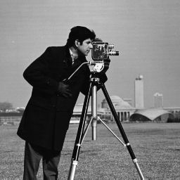
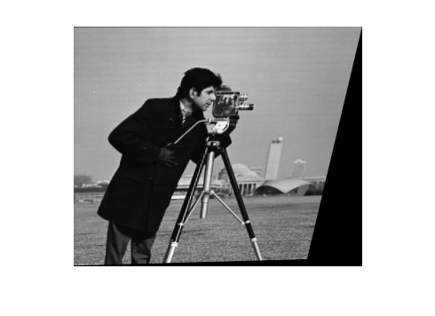
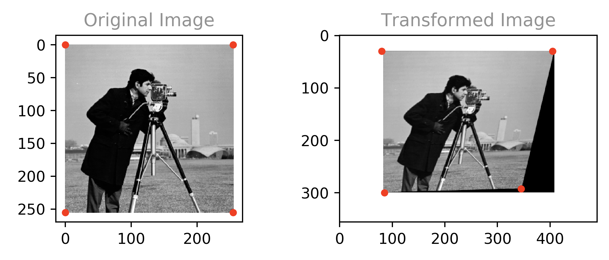
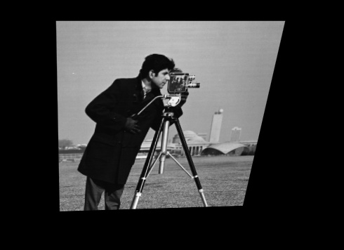
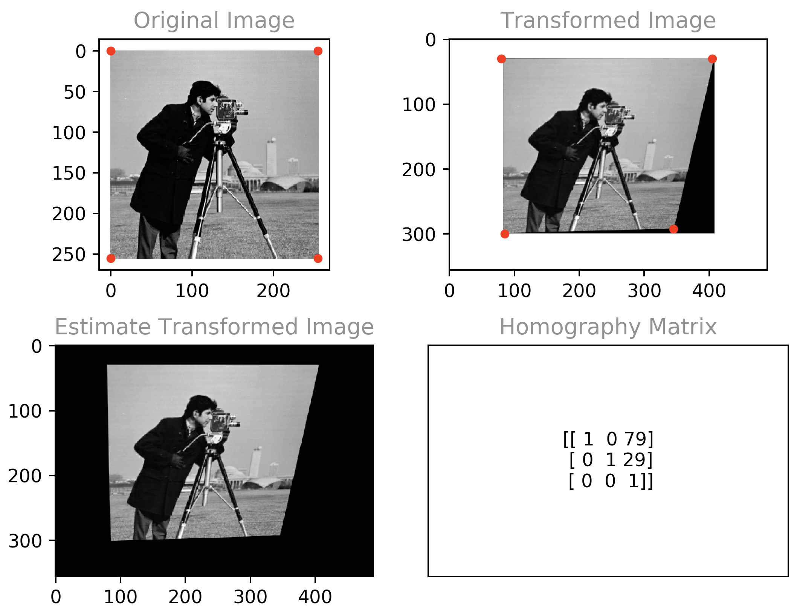

# MMN 14 - Digital Image Processing

## Question 1

Estimate the transformation from ```cameraman.jpg``` to ```cameraman2.jpg``` and output the registered image. 

#### Original Image



#### Transformed Image



### Solution

We'll start by noticing that some lines which are parallel in the original image are not so in the transformed image. Therefore, the transformation is not affine. We'll also notice that straight lines in the original image have remained straight. Therefore, the transformation is most likely at least approximately linear. We conclude a projection transformation is a good fit for a homography estimate. 

 We calculate the homography projection matrix estimate by manually selecting 4 corresponding reference points and calculating the 8 coefficients as outlined on p.90 in the course book. We use the OpenCV function findHomography() to avoid manual calculation. Subsequently, we utilize the homography matrix to produce the registered image. 

#### Corresponding Points Selection




#### Calculated Homography Matrix

````
[[ 1  0 79]
 [ 0  1 29]
 [ 0  0  1]]
````


#### Registered Image



#### Source Code

```Python
# library imports
import numpy as np
import cv2
from matplotlib import pyplot as plt

# cosmetics
PLOT_PIXEL_DENSITY = 175
POINT_SIZE = 15
POINT_COLOR = 'red'
TITLE_COLOR = 'grey'

# init plot with better pixel density
fig = plt.figure(dpi=PLOT_PIXEL_DENSITY)

# use this to get a console printout of subplot click pixel coordinates
# fig.canvas.mpl_connect('button_press_event', lambda event: print(round(event.xdata), round(event.ydata)))

# corresponding reference points - manually selected 
src_pts = np.array([[0, 0], [255, 0], [0, 255], [255, 255]])
src_x, src_y = src_pts.T
dst_pts = np.array([[80, 30], [405, 30], [85, 300], [345, 292]])
dst_x, dst_y = dst_pts.T

# read the images from disk as greyscale
src_im = cv2.imread('cameraman.jpg', cv2.IMREAD_GRAYSCALE)  # source image
dst_im = cv2.imread('cameraman2.jpg', cv2.IMREAD_GRAYSCALE)  # destination image

# Calculate estimated homography matrix
hom, status = cv2.findHomography(src_pts, dst_pts)

# generate the registered image
reg_im = cv2.warpPerspective(src_im, hom, (dst_im.shape[1], dst_im.shape[0]))

# draw original image
plt.subplot(221)
plt.title("Original Image", color=TITLE_COLOR)
plt.imshow(src_im, cmap="gray")
plt.scatter(src_x, src_y, c=POINT_COLOR, s=POINT_SIZE)  # draw the corresponding points

# draw transformed image
plt.subplot(222)
plt.title("Transformed Image", color=TITLE_COLOR)
plt.imshow(dst_im, cmap="gray")
plt.scatter(dst_x, dst_y, c=POINT_COLOR, s=POINT_SIZE)  # draw the corresponding points

# draw image produced from homography estimate
plt.subplot(223)
plt.title("Estimate Transformed Image", color=TITLE_COLOR)
plt.imshow(reg_im, cmap="gray")

# draw the homography matrix as text
plt.subplot(224)
plt.title("Homography Matrix", color=TITLE_COLOR)
plt.text(0.5, 0.5, np.array2string(hom.astype(dtype=int)), ha='center', va='center')
# hide text subplot labels and ticks
plt.tick_params(axis='both', which='both', bottom='off', labelbottom='off', left='off', labelleft='off')

# adjust spacing between images
plt.tight_layout()

# display the plot
plt.show()
```


#### Code Output




## Question 2

### 8.1.a

Nope. For an image with 2^n intensity levels and an equalized histogram there's no advantage to using a variable length encoding because all intensity levels have an equal frequency so the variable length code won't save us any bits. 

### 8.1.b

Possibly. It really depends on how the different intensity values are distributed over the image. If there are concentrations of specific intensities it might be worth while to encode their boundries instead of each symbol individually (e.g black/white documents) . Moreover, if there exists a correlation between intensity values which allows for predicting one value based on another (e.g an image containing a linear gradient) - we can encode the relationship instead of each actual value (e.g vector graphics).

_Temporal Redundancy_: I have no idea what's temporal redundancy in the contex of static images.

### 8.2.a

Given a binary image of size $ 2^n \times 2^n $, each scan lines contains $2^n$ bits. The encoding requires $ lg(2^n) = n $  bits to encode the run length and another $n$ bits to encode the starting position, for a total of $2n$ bits per run symbol. Further, for $r$ the runs per scan line, we get $2nr$ symbol bits. In addition, there's an overhead of $2n$ bits per scan line needed to represent the newline symbol (0,0). Thus, the expression for the the mean bits per line is $ l_{avg} = 2n + 2nr_{avg} $. 

By way of the above, we finally arrive at the expression for the average run length required to ensure compression:

$$ 2^n > 2n + 2nr_{avg} \implies \frac{2^n -2n}{2n}  > r_{avg} $$  

### 8.2.b

For $n=10$ we can calculate the upper bound for the average runs per scan line using the expression deduced in _8.2.a_ as follows: 

$$  \frac{2^n -2n}{2n}  = \frac{2^{10} - 20}{20} =  50.2 > r_{avg} $$

We conclude 50.2 is the supremum of the average runs per scan line to ensure compression.


## Question 3

We're given the following 8 bit image.

```
[[21, 21, 21, 95, 169, 243, 243, 243],
 [21, 21, 21, 95, 169, 243, 243, 243],
 [21, 21, 21, 95, 169, 243, 243, 243],
 [21, 21, 21, 95, 169, 243, 243, 243]]
```

### 8.9.a

We calculate the image entropy to be 1.81 bits per pixel by way of the code below. 

```Python
import numpy as np

# input image: 4x8 pixels, 8 bits per pixel.
input_im = np.array([[21, 21, 21, 95, 169, 243, 243, 243],
                     [21, 21, 21, 95, 169, 243, 243, 243],
                     [21, 21, 21, 95, 169, 243, 243, 243],
                     [21, 21, 21, 95, 169, 243, 243, 243]]).flatten()

def calc_img_entropy(img):
      """ compute and print out the entropy of the input image """
   
    # enable a pretty printout for floats
    np.set_printoptions(precision=3, formatter={'float_kind': lambda x: "%.2f" % x})

    # pixel count - NxM
    pxl_num = np.alen(img)

    # unique intensity levels - r_k
    lvls = np.unique(img)

    # num of unique intensity levels - L
    lvls_num = len(lvls)

    # compute the histogram - n_k
    im_hist, bin_edges = np.histogram(img, bins=lvls_num)

    # compute the probability of each level - p(r_k)
    lvls_prob = im_hist / pxl_num
    print('probabilities: ', lvls_prob)

    # compute the log_2 of each level probability - lg(p(r_k))
    lvls_prob_log = np.log2(lvls_prob)
    print('log_2 of probabilities: ', lvls_prob_log)

    # compute the entropy of the image - \hat{H}
    img_entropy = -np.sum(lvls_prob * lvls_prob_log)
    print('image entropy: ', '%.2f' % img_entropy)

    # sanity check:
    # 1) from scipy import stats as st
    # 2) compare against output of st.entropy()
    # print(scipy.stats.entropy(lvls_prob, base=2))

    # reset custom printout opt
    np.set_printoptions()
```


### 8.9.b

We Huffman encode the given image by way of the code below to produce the following output:

```Shell
codebook:  {169: '110', 243: '0', 21: '10', 95: '111'}
encoded bits:  101010111110000101010111110000101010111110000101010111110000
```

Source Code: 

```python
import numpy as np
from heapq import *

def huffman_encode(img):
    """Huffman encode the given image """

    # count the number of unique pairs
    lvls, count = np.unique(img, return_counts=True)

    # build the min heap
    heap = [[heap, [lvls, ""]] for lvls, heap in zip(lvls, count)]
    heapify(heap)

    # extract min leaf and merge until only root left
    while len(heap) > 1:
        lo = heappop(heap)
        hi = heappop(heap)
        # assign code bits
        for pair in lo[1:]:
            pair[1] = '0' + pair[1]
        for pair in hi[1:]:
            pair[1] = '1' + pair[1]
        # push node with merged count
        heappush(heap, [lo[0] + hi[0]] + lo[1:] + hi[1:])

    # create the codebook dictionary
    codebook = dict(sorted(heappop(heap)[1:], key=lambda p: (len(p[-1]), p)))

    # print the codebook
    print(codebook)
    # print the encoded image
    print(''.join([codebook[v] for v in img]))
```

_NOTE_: adapted from RessetaCode

### 8.9c

The given image had $ 4 \times 8 = 32 $ intensity values of 8 bits each, for a total representation length of 256 bits.The encoding produced a 60 bit binary string. Consequently, without accounting for the codebook overhead, the compression ration achieved is $ CR = 256/60= 4.2\hat{6} \approx  4.27:1 $. 

The encoded bits per pixel average is $ \hat{L}_{avg} = 60/32 = 1.875 $. Therefore, we've achieved an efficiency of $\eta = 1.811/1.875 = 0.9658 = 96.58\% $ of the lower bound set by Shannon's noiseless coding theorem.

### 8.9d

Assuming pair selection is done by simply taking consecutive elements and the standard scan order

````
all pairs:  [[ 21  21]
 [ 21  95]
 [169 243]
 [243 243]
 [ 21  21]
 [ 21  95]
 [169 243]
 [243 243]
 [ 21  21]
 [ 21  95]
 [169 243]
 [243 243]
 [ 21  21]
 [ 21  95]
 [169 243]
 [243 243]]
 
unique pairs:  [[ 21  21]
 [ 21  95]
 [169 243]
 [243 243]]
 
pair entropy:  1.0 bits per pixel
````

Code used to generate the above output

````Python
from scipy import stats as st

def pair_entropy(img):
    """ print the independent entropy lower bound when encoding intensity level pairs """

    # pair up the intensity levels
    pairs = np.reshape(img, (-1, 2))

    print('all pairs: ', pairs)

    # count the number of unique pairs
    unique, count = np.unique(pairs, axis=0, return_counts=True)

    print('unique pairs: ', unique)

    # compute the probability of each pair
    probs = count / len(pairs)

    # calculate the entropy of the pairs, divide by 2 because each each pair is 2 pixels 
    ent = st.entropy(probs, base=2) / 2

    print('pair entropy: ', ent, 'bits per pixel')


pair_entropy(input_im)
````


### 8.9.e

We compute the difference entropy to be 1.51 bits per pixel. Recalling the independent intensity value entropy is 1.81 bits per pixel, we conclude pixel values are not independent and are in fact significantly correlated.

````
pixel differences:  [  21    0    0   74   74   74    0    0 -222    0    0   74   74   74    0
    0 -222    0    0   74   74   74    0    0 -222    0    0   74   74   74
    0    0]
pixel difference entropy:  1.51 bits per pixel
````

```python
from scipy import stats as st

def difference_entropy(img):
    """ prints entropy of pixel difference representation """

    # calculate the pixel differences
    difs = np.diff(img)

    # append the original first element to the start of difference array
    difs = np.append(img[0:1],difs)

    print('pixel differences: ', difs)

    unique, count = np.unique(difs, axis=0, return_counts=True)

    # compute probabilities
    probs = count / len(difs)

    # calculate the pixel difference entropy
    ent = st.entropy(probs, base=2)

    print('pixel difference entropy: ', '%.2f' % ent, 'bits per pixel')
 
difference_entropy(input_im)
```


### 8.9.f

The computation in _A_ assumes independent symbols. The computation in _D_ yields lower entropy due to pixel intensity values being correlated, and pair encoding makes some use of the correlation. The computation in _E_ makes further use of existing correlations to yield an even lower bit rate. 


## Question 4.a

### DCT Advantages

1. Real valued
2. Better Concentration of information
3. Can be equal to KLT for markovian images


## Question 4.b

### Huffman encoding histogram equalized images

Huffman encoding the original image will be more effective. Applying a Huffman code to an image with an equalized histogram will not be effective since there's no spatial redudancy and therefore nothing is gained by using a variable length code. This can demonstrated by calculating the entropy - the experiment will yield an average lower bound bitrate approximately equal to the unencoded bitrate.

## Question 4.c

 LZW, unlike Huffman, makes use of pixel value correlations to dynamically encode multiple symbols. In contrast, Huffman coding assumes independency and is done per intensity level. Consequentially, LZW can be especially advantageous over Huffman in cases where an image has an approximately equalized histogram but intensity values are highly correlated. 